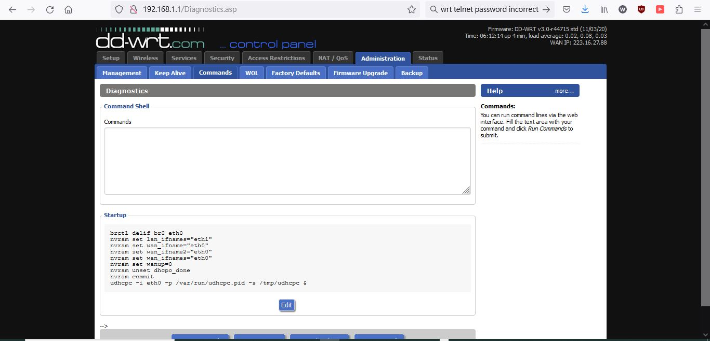
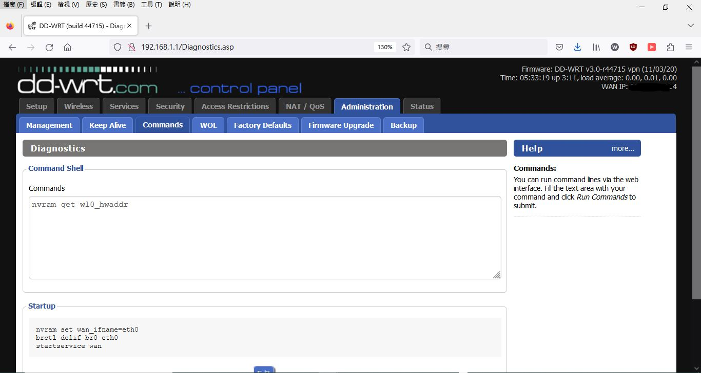
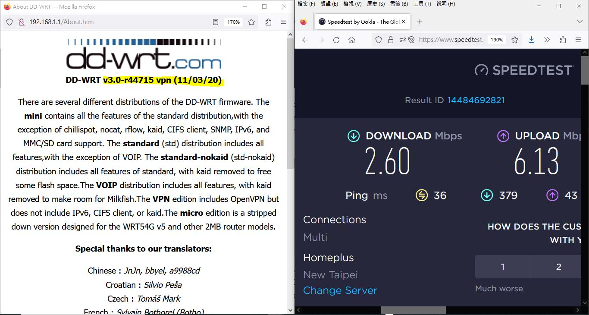
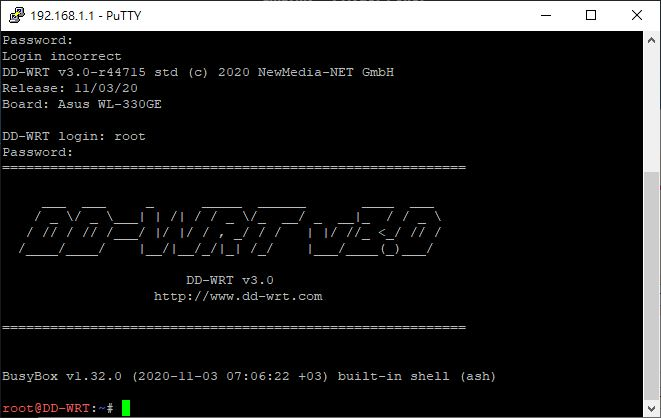

# uses DD-WRT firmware

### download firmwares
https://dd-wrt.com/support/router-database/?model=WL-330gE_-

### uses this firmware for testing and done, it works 
note, version info displayed was wrong with "vpn"  
https://download1.dd-wrt.com/dd-wrtv2/downloads/betas/2020/11-03-2020-r44715/broadcom/dd-wrt.v24_std_generic.bin


```
brctl delif br0 eth0
nvram set lan_ifnames="eth1"
nvram set wan_ifname="eth0"
nvram set wan_ifname2="eth0"
nvram set wan_ifnames="eth0"
nvram set wanup=0
nvram unset dhcpc_done
nvram commit
udhcpc -i eth0 -p /var/run/udhcpc.pid -s /tmp/udhcpc &
```


### testing


ok, netgear orbi router is not supporting bcm wifi card, real slow, this old router is better performance, but why ?  
dd-wrt.v24_std_generic.bin used, but version info displayed was wrong with "vpn"  




### how to make it work to connect to internet
https://forum.dd-wrt.com/phpBB2/viewtopic.php?p=410825  
https://www.medo64.com/2012/02/ddwrt-on-wl330ge/  

Once the WL330gE is running dd-wrt, you might notice that you are unable to find the wireless network 'dd-wrt'. dd-wrt has some slight issues with the asus WL-330gE's 1 ethernet port. dd-wrt's default settings will cause the wireless interface to be the router's WAN-port. This will cause problems.

1. Go to Setup > Networking > Port Setup and set WAN Port Assignment to 'Disabled'. Once these settings are applied you will find the wireless network 'dd-wrt'.
2. Setup your wireless netwerk. Set a ssid, and protect your network.

If you wish to use the ethernet port as a WAN-port:
3. Connect to this wireless netwerk and go to 
Setup > Networking > Port Setup and set WAN Port Assignment to 'eth0'. Once these settings are applied you may continue to configure your router using the wireless netwerk. The ethernet port was become the router's WAN-port.

### this made it works, ISP assign static IP, no uses PPPoE  
login router, click tabs,  
```
Setup > Networking > Port Setup and set WAN Port Assignment to 'eth0'  
```

Administration > Command start-up script then save /run, reboot device  
this is NOT working  
```
nvram set wan_ifname=eth0
brctl delif br0 eth0
startservice wan
```
this is working,  
```
nvram set wan_ifname="eth0"
brctl delif br0 eth0
startservice wan
```


### try some test
```
nvram get lan_hwaddr
nvram get wan_hwaddr
nvram get wl0_hwaddr
```
only last command gives response with MAC wl0_hwaddr 48:5B:39:E7:1D:B0, same as eth1


### version used DD-WRT v3.0-r44715 vpn (11/03/20)
```
DD-WRT v3.0-r44715 vpn (11/03/20)

There are several different distributions of the DD-WRT firmware. 
The mini contains all the features of the standard distribution,with the exception of chillispot, nocat, rflow, kaid, CIFS client, SNMP, IPv6, and MMC/SD card support. 

The standard (std) distribution includes all features, with the exception of VOIP. 

The standard-nokaid (std-nokaid) distribution includes all features of standard, with kaid removed to free some flash space.

The VOIP distribution includes all features, with kaid removed to make room for Milkfish.

The VPN edition includes OpenVPN but does not include IPv6, CIFS client, or kaid.

The micro edition is a stripped down version designed for the WRT54G v5 and other 2MB router models.
```

### hold reset button & power up, enter RECOVERY mode, TFTP server connection has to be
uses this TFTP64 & connect serial termianl, 115200 baud n81.
note: online updated dd-wrt firmware, 
recovery mode was 192.168.1.220, changed to 192.168.1.1
no more compatible with ASUS orignal recovery firmware!!

```
Decompressing..........done


CFE version 1.0.37 for BCM947XX (32bit,SP,LE)
Build Date: Fri Apr 11 15:23:32 CST 2008 (root@localhost.localdomain)
Copyright (C) 2000,2001,2002,2003 Broadcom Corporation.

Initializing Arena
Initializing Devices.
Boot partition size = 131072(0x20000)
et0: Broadcom BCM47xx 10/100 Mbps Ethernet Controller 4.130.31.0
CPU type 0x29029: 240MHz
Total memory: 16384 KBytes

Total memory used by CFE:  0x80400000 - 0x80497DD0 (622032)
Initialized Data:          0x8042F150 - 0x80431610 (9408)
BSS Area:                  0x80431610 - 0x80431DD0 (1984)
Local Heap:                0x80431DD0 - 0x80495DD0 (409600)
Stack Area:                0x80495DD0 - 0x80497DD0 (8192)
Text (code) segment:       0x80400000 - 0x8042F150 (192848)
Boot area (physical):      0x00498000 - 0x004D8000
Relocation Factor:         I:00000000 - D:00000000

Device eth0:  hwaddr 48-5B-39-E7-1D-AE, ipaddr 192.168.1.1, mask 255.255.255.0
        gateway not set, nameserver not set
Null Rescue Flag.
Hello!! Enter Rescue Mode: (by Force)

Reading :: TFTP Server.
Failed.: Timeout occured
Reading :: TFTP Server.
Failed.: Timeout occured
Reading :: TFTP Server.
Failed.: Timeout occured
Reading :: TFTP Server.
Failed.: Timeout occured
Reading :: TFTP Server.
Failed.: Timeout occured
Reading :: TFTP Server.
Failed.: Timeout occured
Reading :: TFTP Server.
```

### 1st burm firemware and log
```
TFTP_BLKLEN!!
break!! last block!!
Done. 3121172 bytes read
Download of 0x2fa014 bytes completed
Write kernel and filesystem binary to FLASH (0xbfc20000)
Programming...
copysize=3121172, amtcopy=3121172 
done. 3121172 bytes written

```


### 1st boot log
```
Decompressing..........done

CFE version 1.0.37 for BCM947XX (32bit,SP,LE)
Build Date: Fri Apr 11 15:23:32 CST 2008 (root@localhost.localdomain)
Copyright (C) 2000,2001,2002,2003 Broadcom Corporation.

Initializing Arena
Initializing Devices.
Boot partition size = 131072(0x20000)
et0: Broadcom BCM47xx 10/100 Mbps Ethernet Controller 4.130.31.0
CPU type 0x29029: 240MHz
Total memory: 16384 KBytes

Total memory used by CFE:  0x80400000 - 0x80497DD0 (622032)
Initialized Data:          0x8042F150 - 0x80431610 (9408)
BSS Area:                  0x80431610 - 0x80431DD0 (1984)
Local Heap:                0x80431DD0 - 0x80495DD0 (409600)
Stack Area:                0x80495DD0 - 0x80497DD0 (8192)
Text (code) segment:       0x80400000 - 0x8042F150 (192848)
Boot area (physical):      0x00498000 - 0x004D8000
Relocation Factor:         I:00000000 - D:00000000

Device eth0:  hwaddr 48-5B-39-E7-1D-AE, ipaddr 192.168.1.1, mask 255.255.255.0
        gateway not set, nameserver not set
Null Rescue Flag.
Loader:raw Filesys:tftp Dev:eth0 File:: Options:(null)
Loading: TFTP Server.
Failed.
Could not load :: Timeout occured
Loader:raw Filesys:raw Dev:flash0.os File: Options:(null)
Loading: ...... 1605632 bytes read
Entry at 0x80001000
Closing network.
Starting program at 0x80001000
CPU revision is: 00029029

Primary instruction cache 16kb, linesize 16 bytes (4 ways)

Primary data cache 16kb, linesize 16 bytes (2 ways)

Linux version 2.4.20 (root@localhost.localdomain) (gcc version 3.2.3 with Broadcom modifications) #2388 Thu Jan 27 10:27:11 CST 2011

Setting the PFC to its default value

Determined physical RAM map:

 memory: 01000000 @ 00000000 (usable)

On node 0 totalpages: 4096

zone(0): 4096 pages.

zone(1): 0 pages.

zone(2): 0 pages.

Kernel command line: root=/dev/mtdblock2 noinitrd console=ttyS0,115200

CPU: BCM5354 rev 3 at 240 MHz

Calibrating delay loop... 237.56 BogoMIPS

Memory: 14408k/16384k available (1372k kernel code, 1976k reserved, 108k data, 64k init, 0k highmem)

Dentry cache hash table entries: 2048 (order: 2, 16384 bytes)

Inode cache hash table entries: 1024 (order: 1, 8192 bytes)

Mount-cache hash table entries: 512 (order: 0, 4096 bytes)

Buffer-cache hash table entries: 1024 (order: 0, 4096 bytes)

Page-cache hash table entries: 4096 (order: 2, 16384 bytes)

Checking for 'wait' instruction...  unavailable.

POSIX conformance testing by UNIFIX

PCI: no core

PCI: Fixing up bus 0

Linux NET4.0 for Linux 2.4

Based upon Swansea University Computer Society NET3.039

Initializing RT netlink socket

Starting kswapd

devfs: v1.12c (20020818) Richard Gooch (rgooch@atnf.csiro.au)

devfs: boot_options: 0x1

pty: 256 Unix98 ptys configured

Serial driver version 5.05c (2001-07-08) with MANY_PORTS SHARE_IRQ SERIAL_PCI enabled

ttyS00 at 0xb8000300 (irq = 3) is a 16550A

ttyS01 at 0xb8000400 (irq = 0) is a 16550A

PPP generic driver version 2.4.2

PPP Deflate Compression module registered

PPP BSD Compression module registered

MPPE/MPPC encryption/compression module registered

 Amd/Fujitsu Extended Query Table v1.1 at 0x0040

number of CFI chips: 1

Flash device: 0x400000 at 0x1c000000

Physically mapped flash: squashfs filesystem found at block 800

Creating 4 MTD partitions on "Physically mapped flash":

0x00000000-0x00020000 : "boot"

0x00020000-0x003f0000 : "linux"

0x000c8388-0x003f0000 : "rootfs"

0x003f0000-0x00400000 : "nvram"

sflash: found no supported devices

NET4: Linux TCP/IP 1.0 for NET4.0

IP Protocols: ICMP, UDP, TCP

IP: routing cache hash table of 512 buckets, 4Kbytes

TCP: Hash tables configured (established 1024 bind 2048)

ip_conntrack version 2.1 (128 buckets, 1024 max) - 344 bytes per conntrack

ip_conntrack_pptp version 1.9 loaded

ip_nat_pptp version 1.5 loaded

ip_tables: (C) 2000-2002 Netfilter core team

ipt_time loading

NET4: Unix domain sockets 1.0/SMP for Linux NET4.0.

NET4: Ethernet Bridge 008 for NET4.0

802.1Q VLAN Support v1.7 Ben Greear <greearb@candelatech.com>

All bugs added by David S. Miller <davem@redhat.com>

VFS: Mounted root (squashfs filesystem) readonly.

Mounted devfs on /dev

Freeing unused kernel memory: 64k freed

Algorithmics/MIPS FPU Emulator v1.5

eth0: Broadcom BCM47xx 10/100 Mbps Ethernet Controller 4.130.32.0

eth1: Broadcom BCM4318 802.11 Wireless Controller 4.130.32.0

device eth0 entered promiscuous mode

eth1: Invalid argument
device eth1 entered promiscuous mode

br0: port 2(eth1) entering learning state

br0: port 2(eth1) entering forwarding state

br0: topology change detected, propagating

br0: port 1(eth0) entering learning state

br0: port 1(eth0) entering forwarding state

br0: topology change detected, propagating

eth0: No such process
PCI devices found:
    Class 0501: PCI device 14e4:0800 (rev 3).
    Class 0200: PCI device 14e4:4713 (rev 3).
    Class 0b30: PCI device 14e4:0816 (rev 3).
    Class 0c03: PCI device 14e4:471a (rev 3).
    Class 0c03: PCI device 14e4:471a (rev 3).
    Class 0500: PCI device 14e4:080f (rev 3).
    Class 0280: PCI device 14e4:4318 (rev 3).
    Class 0280: PCI device 14e4:4719 (rev 3).
echo for PaN ::: &&&PaN


```

### telnet / ssh  
user name always : root  
password, login password of your dd-wrt  
  
